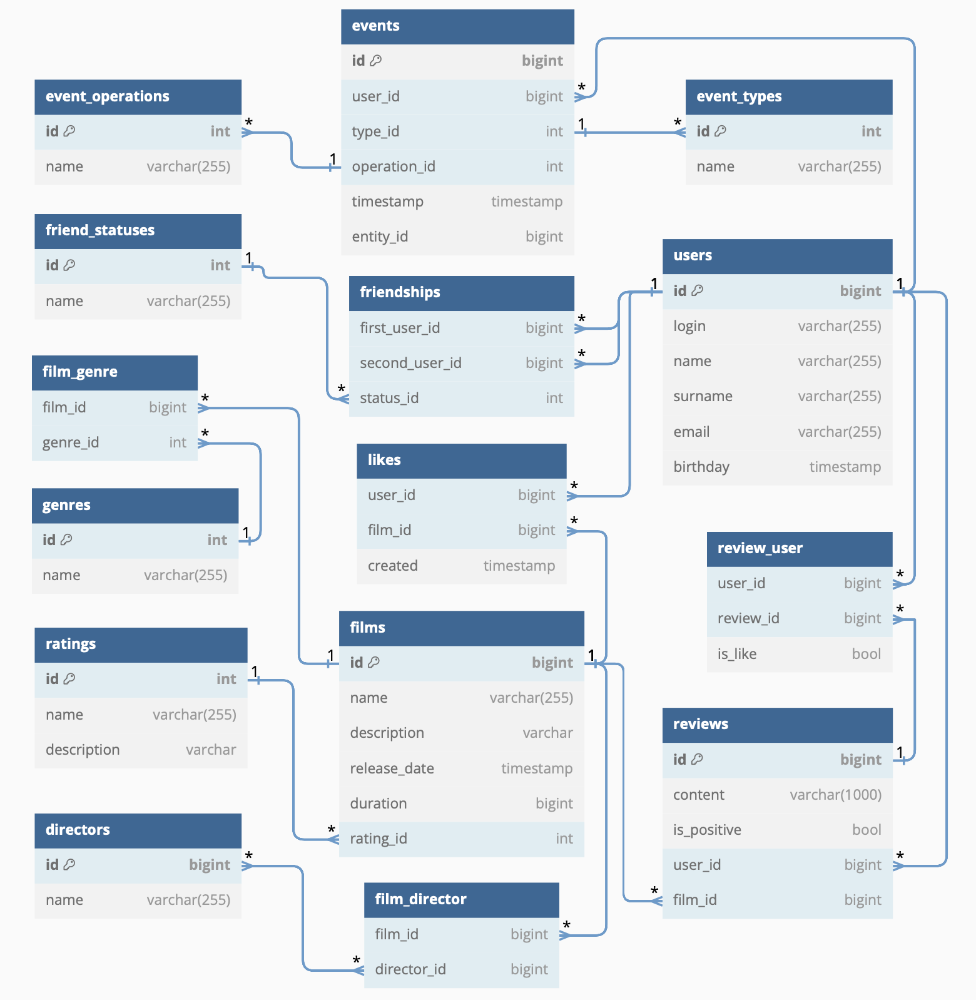

# Веб сервис Filmorate
## Схема базы данных

## Примеры запросов
### Топ N фильмов
#### Вариант № 1
```sql
SELECT * 
FROM films AS f
ORDER BY (SELECT count(*) FROM likes AS l GROUP BY film_id HAVING f.id = l.film_id) DESC
LIMIT :N;
```
#### Вариант № 2
```sql
SELECT f.*, COUNT(l.film_id) AS film_likes
FROM Films AS f
LEFT JOIN likes AS l ON f.id = l.film_id
GROUP BY f.id
ORDER BY film_likes DESC
LIMIT :N;
```
### Получить все жанры фильма по ID
```sql
SELECT f.genre_id AS id, g.name
FROM film_genre AS f 
JOIN genres g ON g.id = f.genre_id
WHERE film_id = :film_id;
```
### Получить список друзей пользователя по ID
```sql
SELECT (first_user_id + second_user_id - :user_id)
FROM friendships f WHERE (first_user_id = :user_id);
```